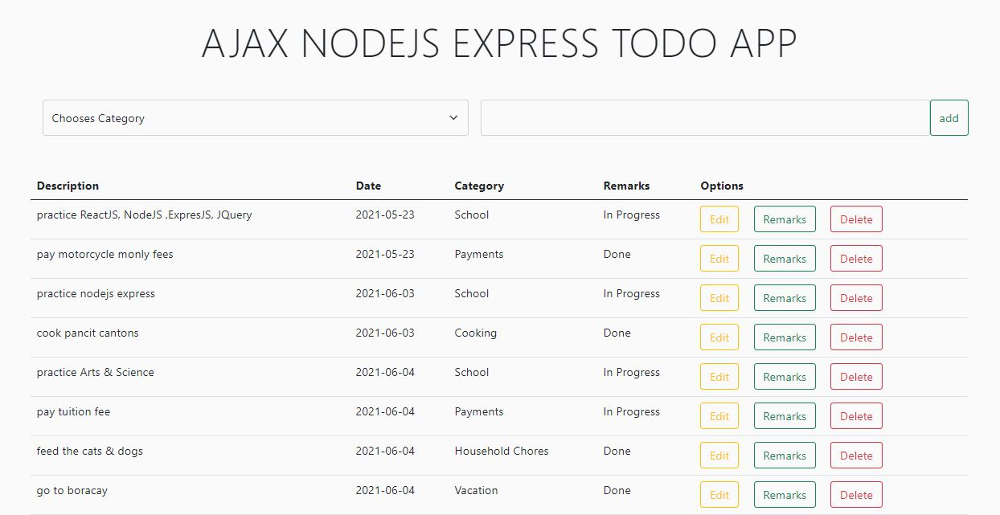

# AJAX NODEJS EXPRESS TODO APP

Screen Shot:

Technology Use:

-   **AJAX Calls** - Fetch API
-   **Front-End** - HTML, CSS, Bootstrap, JS
-   **Back-End** - NodeJS, Express
-   **Database** - PostgreSQL

Features:

-   **Add todo** - Enables to add todo.
-   **Edit todo** - Enable to change the description of a spicific todo.
-   **Update remarks** - Enables to add update remarks of a todo from `In Progress` to `Done` or **vice versa**.
-   **Delete todo** - Enable to delete a spicific todo.

###### &nbsp;&nbsp;&nbsp;Github Repository: https://github.com/reymondgomera/ajax_todoapp.git
